# Object Oriented Programming

<!--toc:start-->
- [Object Oriented Programming](#object-oriented-programming)
  - [What is Object Oriented Programming](#what-is-object-oriented-programming)
  - [Class-based Programming](#class-based-programming)
    - [Real World Object Exercise](#real-world-object-exercise)
      - [State and Behavior](#state-and-behavior)
    - [The class as the blueprint](#the-class-as-the-blueprint)
      - [Organizing classes and Access modifiers for the class](#organizing-classes-and-access-modifiers-for-the-class)
      - [Access modifiers for class members](#access-modifiers-for-class-members)
  - [Encapsulation](#encapsulation)
  - [Example](#example)
  - [Introduction to Classes](#introduction-to-classes)
    - [What is null?](#what-is-null)
    - [Default values for fields on classes](#default-values-for-fields-on-classes)
    - [Method getter and setter](#method-getter-and-setter)
      - [What are getters and setters? Why should we use them?](#what-are-getters-and-setters-why-should-we-use-them)
      - [this keyword](#this-keyword)
    - [Constructor](#constructor)
      - [The default constructor](#the-default-constructor)
      - [Constructor overloading](#constructor-overloading)
      - [Constructor chaining with this()](#constructor-chaining-with-this)
  - [Reference vs Object vs Instance vs Class](#reference-vs-object-vs-instance-vs-class)
    - [The reference vs The object](#the-reference-vs-the-object)
  - [Static vs Instance Variables](#static-vs-instance-variables)
    - [Static Variables](#static-variables)
    - [Instance Variables](#instance-variables)
    - [Static Methods](#static-methods)
    - [Instance Methods](#instance-methods)
    - [Summary](#summary)
  - [Plain Old Java Object (POJO)](#plain-old-java-object-pojo)
    - [The Entity - The Student Table](#the-entity-the-student-table)
      - [Annotation](#annotation)
      - [Overridden Method](#overridden-method)
    - [The POJO (Entity) vs. The Record](#the-pojo-entity-vs-the-record)
      - [The Record type](#the-record-type)
      - [Implicit or Generated Code that Java provides](#implicit-or-generated-code-that-java-provides)
      - [Record is immutable](#record-is-immutable)
      - [POJO vs. Record](#pojo-vs-record)
  - [Inheritance](#inheritance)
    - [The Animal Class](#the-animal-class)
    - [supper keyword](#supper-keyword)
    - [Code Re-use](#code-re-use)
    - [Overriding a method](#overriding-a-method)
  - [java.lang.Object](#javalangobject)
    - [Every class inherits from Object](#every-class-inherits-from-object)
  - [this vs super](#this-vs-super)
    - [Keyword this](#keyword-this)
    - [Keyword super](#keyword-super)
    - [this() vs super() call](#this-vs-super-call)
    - [Example bad and good constructor](#example-bad-and-good-constructor)
      - [Bad constructor](#bad-constructor)
      - [Good constructor](#good-constructor)
    - [super() call example.](#super-call-example)
<!--toc:end-->

## What is Object Oriented Programming

- Object-Oriented Programming is a way to model real-world object as software
  objects which contain both data and code.
- OOP is a common acronym for Object-Oriented Programming.

## Class-based Programming

Class-based programming starts with classes which become the blueprints for objects.

### Real World Object Exercise

- Many examples of real-world objects:
  - A computer
  - A keyboard
  - A door, ...
- Real-world objects have two major components:
  - State
  - Behavior

#### State and Behavior

Example computer

- state:
  - The amount of RAM it has.
  - The operating system it's running.
  - The hard drive size
  - The size of the monitor

&rarr; These are characteristics about the item that can describe it.

- Behavior: In addition to state, objects may also have behavior or actions that
  can be performed by the object, or upon the object.
  - Booting up.
  - Shutting down.
  - Beeping or outputting some form of sound.
  - Drawing something on the screen, and so on.

&rarr; All of these could be described as behavior for a computer.

Example ant

- State:
  - The age.
  - The number of legs.
  - The conscious state.
  - Whether the ant is sleeping or is awake.
- Behavior:
  - Eating.
  - Drinking.
  - Fighting.
  - Carrying food, those types of things.

Modelling real-world objects as software objects is a fundamental part of
**Object-Oriented Programming**.
A software object _**stores**_ its **state in fields**, which can also be called
**variables or attributes**. Objects expose their **behavior with methods** which
I've talked about before.

> [!NOTE]
> Well, think of a class as a template or a blueprint for creating object.

### The class as the blueprint

The class describes the data (fields), and the behavior (methods), that are
relevant to the real-world object we want to describe.

These are called class members. A class member can be a field or a method,
or some other type of dependent element. Class members has two type is Instance
Members and Static Members:

- If a field is static, there is only one copy in memory, or some other type of
  dependent element.
- If a field is not static, it's called an instance field, and each object may
  have a different value stored for this field.
- A static method can't be dependent on any one object's state, so it can't
  reference any instance members.

#### Organizing classes and Access modifiers for the class

Classes can be organized into logical groupings which are called packages.

Can declare a package name in the class using the package statement. If you
don't declare a package, the class implicitly belongs to the default package.

Access modifiers:

- A class is said to be a top-level class if it is defined in the source code
  file and not enclosed in the code block of another class, type, or method.
- A top-level class has only two valid access modifier options: public or none.

| Access keyword | Description                                                                                                                                                                      |
| -------------- | -------------------------------------------------------------------------------------------------------------------------------------------------------------------------------- |
| public         | public means any other class in any package can access this class.                                                                                                               |
|                | When the modifier is omitted, this has special meaning, called package access, meaning the class is access, meaning the class is accessible only to classes in the same package. |

#### Access modifiers for class members

An access modifier at the member level allows granular control over class
members. The valid access modifiers are shown in this table from the least
restrictive to the most restrictive.

| Access keyword | Description                                                                                                                                                      |
| -------------- | ---------------------------------------------------------------------------------------------------------------------------------------------------------------- |
| public         | public means any other class in any package can access this class                                                                                                |
| protected      | protected allows classes in the same package, and any subclasses in other packages, to have access to the member.                                                |
|                | When the modifier is omitted, this has special meaning, called package access, meaning the meaning the member is accessible only to classes in the same package. |
| private        | private means that no other class an access this member                                                                                                          |

## Encapsulation

Encapsulation in Object-Oriented Programming usually has two meanings:

- The bundling of behavior and attributes on a single object.
- The other is the practice of hiding fields and some methods from public
  access.

## Example

```java
public class Car {
    // State (Attribute)
    private String make;
    private String model;
    private String color;
    private int doors;
    private boolean convertible;

    // Behavior (method)
    public void descripbeCar() {
        System.out.println(doors + "-Doors" + " " + color + " " + make + " " + make + " " + model
                + (convertible ? "Convertible" : ""));
    }
}
```

## Introduction to Classes

### What is null?

**null** is a special keyword in Java, meaning, the variable or attribute, has a
type but no reference to an object. This means that no instance or object is
assigned to the variable or field.

Fields with primitive data types are never null.

```java
public class App {
    public static void main(String[] args) throws Exception {
        Car car = new Car();
        car.descripbeCar();
        // 0-Doors null null null null
    }
}
```

- In this example door have data type is **int**. Integer (int) is a primitive
  data type, because door has value 0 not null.

### Default values for fields on classes

Field on classes are assigned default values automatically by java, if don't
assign values yourself.

| Data type                    | Default value assigned |
| ---------------------------- | ---------------------- |
| boolean                      | false                  |
| byte, short, int, long, char | 0                      |
| double, float                | 0.0                    |

Example assign value for variable

**Car.java**

```java
// assign default value for attribute
public class Car {
    private String make = "Tesla";
    private String model = "Model X";
    private String color = "Gray";
    private int doors = 2;
    private boolean convertible = true;

    // Behavior (method)
    public void descripbeCar() {
        System.out.println(
                doors + "-Doors" + " " + color + " " + make + " " + model + " "
      + (convertible ? "Convertible" : ""));
    }
}
```

**App.java**

```java
public class App {
    public static void main(String[] args) throws Exception {
        Car car = new Car();
        car.descripbeCar();
        // 2-Doors Gray Tesla Model X Convertible
    }
}
```

### Method getter and setter

#### What are getters and setters? Why should we use them?

What are getters and setter ?

- A getter is a method on a class that retrieves the value of a private field
  and returns it.
- A setter is a method on a class that sets the value of a private field.
- The purpose of these methods is to control and protect access to private
  field.

Example getters method:

```java
// getter method
public String getMake() {
    return make;
}

public String getModel() {
    return model;
}
```

In setters method:

```java
public void setMake(String make) {
    make = make;
}
```

**Has 2 variable name make. One in class and one a parameter in the method**

#### this keyword

**this** is a special keyword in Java. What is really refers to is the instance
that was created when the object was instantiated.

So, **this** is a special reference name for the object or instance, which it
can use to describe itself. -> use **this** to access fields on the class.

Correct setter method:

```java
public void setMake(String make) {
    this.make = make;
}
```

### Constructor

A constructor is used in the creation of an object. It is a special type of code
block that has specific name and parameters, much like a method.

```java
public class Account { // this is the class declaration

    public Account(){ // this is the constructor declaration
        // Constructor code is code to be executed as the object is created.
    }
}
```

The constructor has same name as the class itself, and it doesn't return any
values. Never include a return type from a constructor, not even void.

We can, and should, special an appropriate access modifier to control who should
be able to create new instances of the class, using this constructor.

#### The default constructor

If a class contains no constructor declarations,
when a default constructor is implicitly declared. This constructor has no
parameters and is often called the no-args (no arguments). If a class contains
any other constructor declarations, then a default constructor is NOT implicitly
declared.

```java
public class Account {
    private String number;
    private double balence;
    private String customerName;
    private String customerEmail;
    private String customerPhone;

    // getters and setters
}
```

Call default constructors

```java
public class App {
    public static void main(String[] args) throws Exception {
        Account bobsAccount = new Account();

        bobsAccount.setNumber("12345");
        bobsAccount.setBalence(1000.0);
        bobsAccount.setCustomerName("Bob Bob");
        bobsAccount.setCustomerEmail("myemail@bob.com");
        bobsAccount.setCustomerPhone("12312131231");
    }
}
```

#### Constructor overloading

Constructor overloading is declaring multiple constructors with different
parameters. The number of parameters can be different between constructors.
Or if the number of parameters is the same between two constructors, their
types, or order of types must differ.

```java
public class Account {
    private String number;
    private double balence;
    private String customerName;
    private String customerEmail;
    private String customerPhone;

    public Account() {}

    public Account(
            String number,
            double balence,
            String customerName,
            String customerEmail,
            String customerPhone) {
        this.number = number;
        this.balence = balence;
        this.customerName = customerName;
        this.customerEmail = customerEmail;
        this.customerPhone = customerPhone;
    }

    private void depositFunds(double depositAmount) {
        balence += depositAmount;
        System.out.println("Deposit of $" + depositAmount + " made. New balence is $ " + balence);
    }

    // getters and setters
}
```

#### Constructor chaining with this()

Constructor chaining is when one constructors explicitly calls another
overloaded constructor. We can only use constructor chaining, within
constructors. We must use the special statement **this()** to execute another
constructor, passing it arguments if required. And **this()** must be the first
executable statement if it's used from another constructor.

Example:

**Account.java**

```java
public class Account {
    private String number;
    private double balence;
    private String customerName;
    private String customerEmail;
    private String customerPhone;

    public Account() {
        this("56789", 2.50, "Default name", "Default address", "Default phone");
        System.out.println("Empty constructor called");
    }

    public Account(
            String number,
            double balence,
            String customerName,
            String customerEmail,
            String customerPhone) {
        this.number = number;
        this.balence = balence;
        this.customerName = customerName;
        this.customerEmail = customerEmail;
        this.customerPhone = customerPhone;
    }

    public Account(String customerName, String customerEmail, String customerPhone) {
        this("99999", 100.55, customerName, customerEmail, customerPhone);
    }

    private void depositFunds(double depositAmount) {
        balence += depositAmount;
        System.out.println("Deposit of $" + depositAmount + " made. New balence is $ " + balence);
    }

    // getters and setters
}
```

**App.java**

```java
public class App {
    public static void main(String[] args) throws Exception {
        Account bobsAccount = new Account();

        System.out.println(bobsAccount.getNumber());
        System.out.println(bobsAccount.getBalence());
        // Empty constructor called
        // 56789
        // 2.5

        Account bobsAccount2 = new Account("Bob Bob", "myemail@bob.com", "12121231231");

        System.out.println(bobsAccount2.getNumber());
        System.out.println(bobsAccount2.getBalence());
        // 99999
        // 100.55
    }
}
```

## Reference vs Object vs Instance vs Class

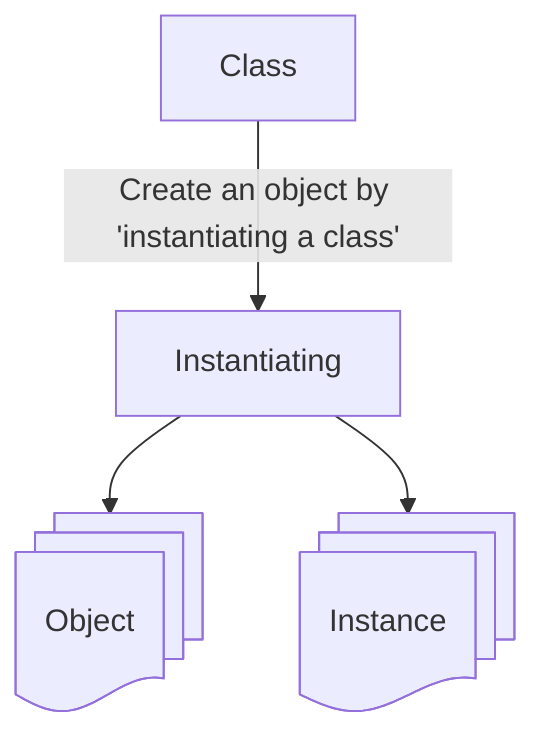

- Object and instance are interchangeable terms
- We can create many object using a single class. Each may have unique attribute
  or values.

<div style="display: flex; justify-content: space-between;">

<div style="width: 40%;">

```java
public class House {
    private String color;

    public House(String color) {
        this.color = color;
    }

    public String getColor() {
        return color;
    }

    public void setColor(String color) {
        this.color = color;
    }

}
```

</div>

<div style="width: 58%;">

```java
public class App {
    public static void main(String[] args) throws Exception {
        House blueHouse = new House("blue");
        House anotherHouse = blueHouse;

        System.out.println(blueHouse.getColor()); // prints blue
        System.out.println(anotherHouse.getColor()); // blue

        anotherHouse.setColor("red");
        System.out.println(blueHouse.getColor()); // red
        System.out.println(anotherHouse.getColor()); // red

        House greenHouse = new House("green");
        anotherHouse = greenHouse;

        System.out.println(blueHouse.getColor()); // red
        System.out.println(greenHouse.getColor()); // green
        System.out.println(anotherHouse.getColor()); // green
    }
}
```

</div>

</div>

<div style="display: flex; justify-content: space-between;">

<div style="width: 40%;">

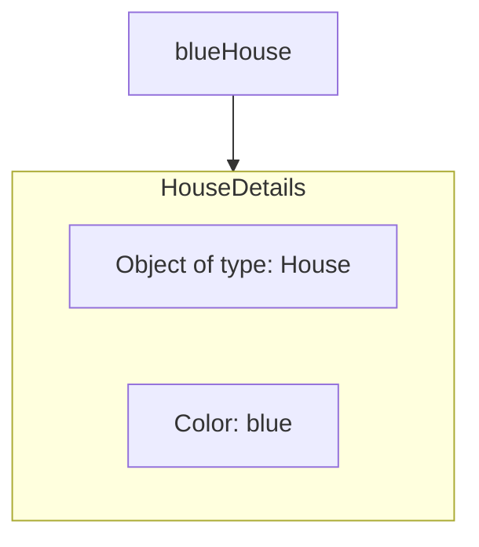

</div>

<div style="width: 58%;">
Line:

```java
House blueHouse = new House("blue");
```

Create new **instance** of House **class**.

Remember House is a blueprint, and we are assigning it to the blueHouse **variable**.
In other words it is a **reference** to the **object** in memory.

</div>

</div>

<div style="display: flex; justify-content: space-between;">

<div style="width: 40%;">


</div>

<div style="width: 58%;">

The next line:

```java
House anotherHouse = blueHouse;
```

create another **reference** to the same **object** in memory.

Here we have two **references** pointing to the **same object** in memory. There
is still one house, but two **reference** to that one **object**.

In other words, we have two pieces of paper with the physical address of where
the house is built.

</div>

</div>

Next we have two println statements that print the blueHouse color and
anotherHouse color:

```java
System.out.println(blueHouse.getColor()); // prints blue
System.out.println(anotherHouse.getColor()); // blue
```

Both will print "blue" since we have two **references** to the same **object**.

<div style="display: flex; justify-content: space-between;">

<div style="width: 40%;">

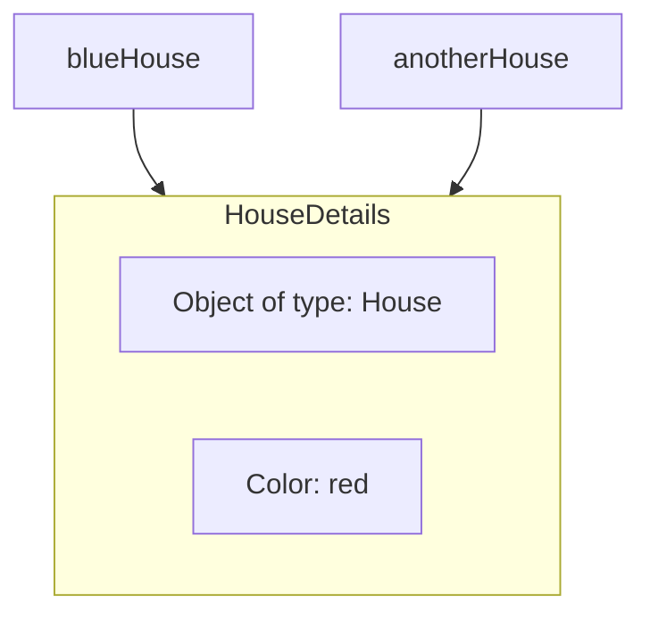

</div>

<div style="width: 58%;">

The next line:

```java
anotherHouse.setColor("red");
System.out.println(blueHouse.getColor()); // red
System.out.println(anotherHouse.getColor()); // red
```

</div>

</div>

Calls the method setColor and sets the color to red. You can that both blueHouse and anotherHouse have the same color now.

Remember we have two **references** that point to the same **object** in memory. Once we change the color, of one, **both references** still point to the same **object**.

In our real world example, there is still just one physical house at the one
address, even though we have written the same address on two pieces of paper.

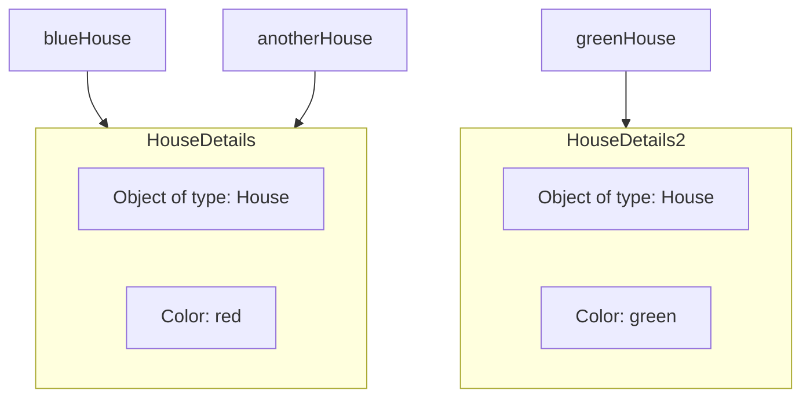

Creating another new instance of the House class with the color set to "green".

```java
House greenHouse = new House("green");
```

Now we have two objects in memory but we have three **reference** which are
blueHouse, anotherHouse and greenHouse. The variable (**reference**) greenHouse
points to a different object in memory, but blueHouse and anotherHouse point to
the same object in memory.

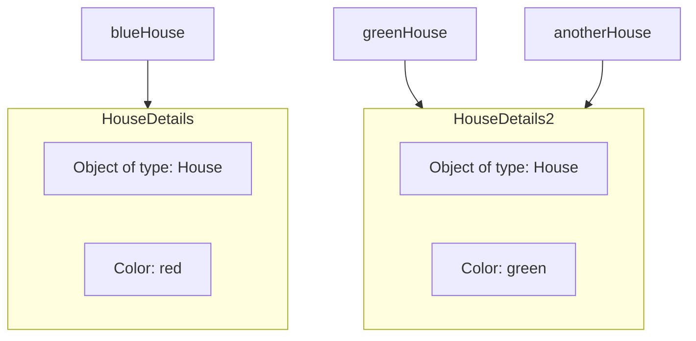

We assign greenHouse to anotherHouse:

```java
anotherHouse = greenHouse;
```

In other words, we are dereferencing anotherHouse. It will now point to a
different **object** in memory. Before it was pointing to a house that had the
"red" color, now it points to the house that has the "green" color. In this
scenario, we still have three **references** and two **objects** in memory but
blueHouse points to one **object** while anotherHouse and greenHouse point to
the same **object** in memory.

Finally, we have three println statements.

```java
System.out.println(blueHouse.getColor()); // red
System.out.println(greenHouse.getColor()); // green
System.out.println(anotherHouse.getColor()); // green
```

The first will print "red" since the blueHouse **variable(reference)** points to
the **object** in memory that has the "red" color, while the next two lines will
print "green" since both anotherHouse and greenHouse to same **object** in
memory.

### The reference vs The object

We do create a reference to the house object we created.

```java
House myHouse = new House("beige"); // house object gets created in memory
// and it's location (reference) is assigned to myHouse.
```

The reference, the variable we call myHouse, we have access to that beige house
as long as my variable, myHouse, stays in scope. Or until it gets reassigned to
reference a different object.

We do create a object and no reference this house

```java
new House("red"); // house object gets created in memory
```

This compiles fine and we can do this.

But this object is created in memory, but after that statement completes, this
code no way to access it. The object exists in memory, but we can't communicate
with it after that statement is executed. That's because I didn't create a
reference to it.

## Static vs Instance Variables

### Static Variables

Declared by using the keyword static. Static variables are also known as static
member variables.

Every instance of the class shares the same static variable. If changes are made
to that variable, all other instance of that class will see the effect of that
change.

```java
public class Dog {
    static String genus = "Canis";

    void printData() {
        Dog d = new Dog();
        System.out.println(d.genus); // confusing
        System.out.println(Dog.genus); // Clearer
    }
}
```

An instance isn't required to exist to access the value of a static variable.

```java
public class Dog {
    static String genus = "Canis";
}
```

```java
public class App {
    public static void main(String[] args) throws Exception {
        System.out.println(Dog.genus); // No instance of Dog needs to exist, in
    //order to access a static variable
    }
}
```

Static variables aren't used very often but can sometimes be very useful. They
can be used for:

- Storing counters.
- Generating unique IDs.
- Storing a constant value that doesn't change, like PI, for example.
- Creating and controlling access to a shared resource.

Example:

```java
public class Dog {
    private static String name;

    public Dog(String name) {
        Dog.name = name;
    }

    public void printName() {
        Dog.name = name; // using Dog.name would have made this code less confusing.
    }
}
```

```java
public class App {
    public static void main(String[] args) throws Exception {
        Dog rex = new Dog("rex"); // create instance (rex)
        Dog fluffy = new Dog("fluffy"); // create instance (fluffy)

        rex.printName(); // print fluffy
        fluffy.printName(); // print fluffy
    }
}
```

### Instance Variables

We **don't** you the static **keyword**.

They're also known as fields or member variables. **Instance variables** belong
to specific instance of a class.

Each instance has its own copy of an instance variable. Every instance can have
a different value. Instance variables represent the state of a specific instance
of a class.

Example:

```java
public class Dog {
    private String name;

    public Dog(String name) {
        this.name = name;
    }

    public void printName() {
        System.out.println("name = " + name);
    }
}
```

```java
public class App {
    public static void main(String[] args) throws Exception {
        Dog rex = new Dog("rex"); // create instance (rex)
        Dog fluffy = new Dog("fluffy"); // create instance (fluffy)

        rex.printName(); // print rex
        fluffy.printName(); // print fluffy
    }
}
```

### Static Methods

Static methods are declared using a static modifier.

**Static methods can't access instance methods and instant variables directly.**
They're usually used for operations that don't required any data from an instace
of the class (from "**this**").

Inside a static method, we can't use the **this** keyword. Whenever you see a
method that doesn't use instance variables, that method should probably by
declared as a static method.

Example:

```java
public class Calculator {

    public static void printSum(int a, int b) {
        System.out.println("sum= " + (a + b));
    }
}
```

```java
public class App {
    public static void main(String[] args) throws Exception {
        Calculator.printSum(5, 10);
        printHello(); // shorter from of Main.printHello();
    }

    public static void printHello() {
        System.out.println("Hello");
    }
}
```

**static methods** are called as **ClassName.methodName()**; or
**methodName()**; only if in the same class.

### Instance Methods

Instance methods belong to an instance of a class. To use an instance method, we
have to instantiate the class first, usually by using the **new** keyword.

**Instance methods can access instance methods and instance variables directly.**
**Instance methods can also access static methods and static variables directly.**

Example:

```java
public class Dog {

    public void bark() {
        System.out.println("woof");
    }
}
```

```java
public class App {
    public static void main(String[] args) throws Exception {
        Dog rex = new Dog(); // create instance
        rex.bark(); // call instance method
    }
}
```

### Summary

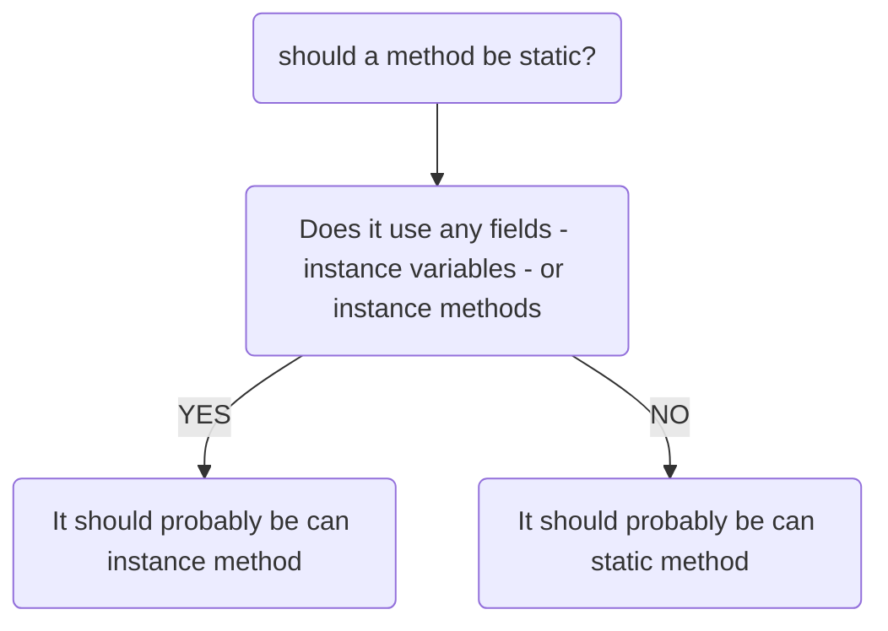

## Plain Old Java Object (POJO)

A plain old java object (whose acronym is **POJO**) is a class that generally
only has instance fields. It's used to house data and pass data between
functional classes.

It usually has no other, or very few methods, other than getters and setters for
the instance fields.

Many database frameworks use POJO's to read data from, or to write data to
databases, files or streams.

Examples of POJOS:

- A POJO also might be called a bean or a JavaBean.
- A JavaBean is just a POJO with some extra rules applied to it.

A POJO is sometimes called an Entity because it mirrors database entities.
Another acronym is DTO for Data Transfer Object. It's a description of an object
that can be modeled as just data.

### The Entity - The Student Table

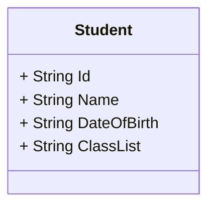

Code example:

```java
public class Student {
    private String id;
    private String name;
    private String dateOfBirth;
    private String classList;

    public Student(String id, String name, String dateOfBirth, String classList) {
        this.id = id;
        this.name = name;
        this.dateOfBirth = dateOfBirth;
        this.classList = classList;
    }

    @Override // annotation
    public String toString() {
        return "Student [id=" + id + ", name=" + name + ", dateOfBirth=" + dateOfBirth + ", classList=" + classList
                + "]";
    }
}
```

```java
public class App {
    public static void main(String[] args) throws Exception {

        for (int i = 1; i <= 5; i++) {
            Student s = new Student("S92300" + i, switch (i) {
                case 1 -> "Mary";
                case 2 -> "Carol";
                case 3 -> "Tim";
                case 4 -> "Harry";
                case 5 -> "Lisa";
                default -> "Anonymous";
            }, "07/12/2000", "Java-Core");

            System.out.println(s);
        }

    }
}
```

#### Annotation

Annotations are a type of metadata. Metadata is a way for formally describe
addition information about our code.

Annotations are more structured and have more meaning that comments. This is
because they can be used by the compiler or other types of pre-processing
functions, to get information about the code.

Metadata doesn't affect how the code runs so this code will still run with or
without the annotation.

Example:

```java
@Override // annotation
public String toString() {
    return "Student [id=" + id + ", name=" + name + ", dateOfBirth=" + dateOfBirth + ", classList=" + classList
            + "]";
}
```

#### Overridden Method

An overridden method is not the same thing as an overloaded method. An
overridden method is a special method in Java that other classes can implement
if they use a specified method signature.

### The POJO (Entity) vs. The Record

#### The Record type

The record was introduced in JDK 14 and became officially part of java in JDK 16.

It's purpose is to replace the boilerplate code of the POJO but to be more
restrictive. Java calls them "plain data carriers".

The record is a special class that contains data that's not meant to be altered.
In other words, it seeks to achieve immutability for the data in its members. It
contains only the most fundamental methods, such as constructors and accessors.
**Best of all, you, the developer, don't have to write or generate any of this
code.**

#### Implicit or Generated Code that Java provides

What does Java tell us about what is implicitly created when we declare a record
as we did in this code?

```java
public record LPAStudent(String id, String name, String dateOfBirth, String classList) {

}
```

First, it's important to understand that the part that's in **parentheses**, is
called the record header. The record header consists of record components, a
comma-delimited list of components.

For each component in the header, Java generates:

- A field with the same name and declared type as the record component.
- The field is declared private and final.
- The field is sometimes referred to as a component field.

Java generates a toString method that prints out each attribute in a formatted
String.

In addition to creating a private final field for each component, Java generates
a public accessor method for each component. This method has the same name any
type of the component, but it doesn't have any kind of special prefix like get
or is, for example. The accessor method for id, in this example, is simply id().

Example:

```java
public class App {
    public static void main(String[] args) throws Exception {
        for (int i = 1; i <= 5; i++) {
            LPAStudent s =
                    new LPAStudent(
                            "S92300" + i,
                            switch (i) {
                                case 1 -> "Mary";
                                case 2 -> "Carol";
                                case 3 -> "Tim";
                                case 4 -> "Harry";
                                case 5 -> "Lisa";
                                default -> "Anonymous";
                            },
                            "07/12/2000",
                            "Java-Core");

            System.out.println(s);
        }

        Student pojoStudent = new Student("S923006", "Ann", "05/11/1985", "Java-Core");
        LPAStudent recordStudent = new LPAStudent("S923007", "Bill", "05/11/1985", "Java-Core");

        System.out.println(pojoStudent.getName() + " is taking " + pojoStudent.getClassList());
        System.out.println(recordStudent.name() + " is taking " + recordStudent.classList());
    }
}
```

#### Record is immutable

There are more use cases for immutable data transfer object and keeping them
well encapsulated. We want to protect the data from unintended mutations.

#### POJO vs. Record

If we want to modify data on your class, you won't be using the record.

But if we're reading a whole lot of records from a database or file source and
simply passing this data around, then the record is a big improvement.

## Inheritance

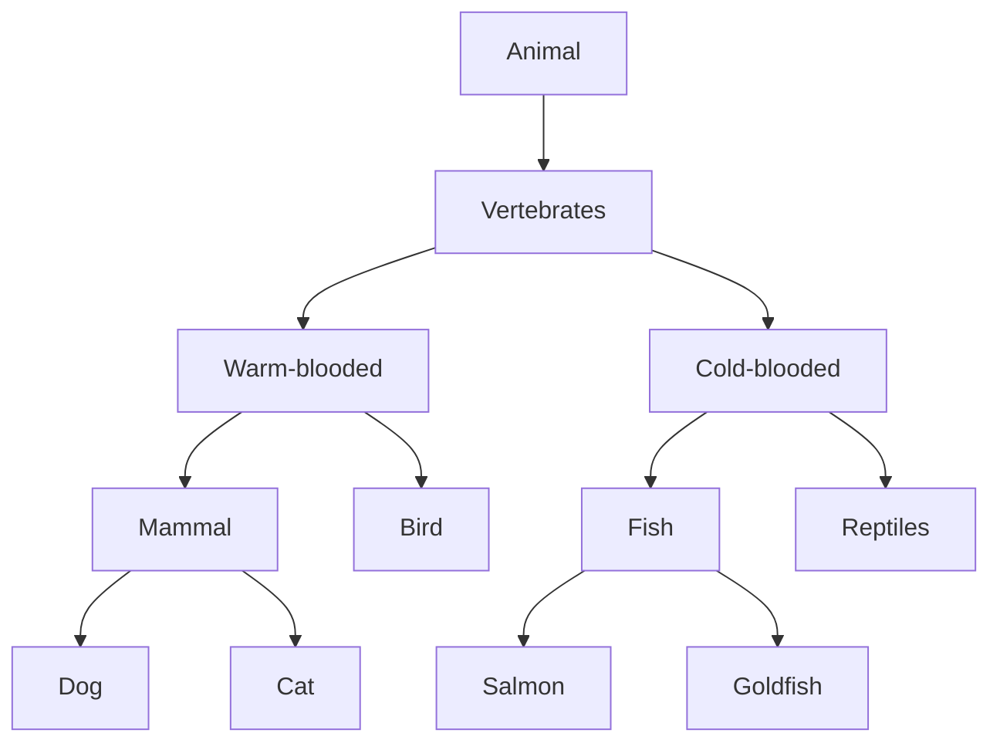

Each box on this diagram represent a Class.
The most generic, or base class, starts at the top of the hierarchy. Every class below it is a subclass.

So Animal is the base class. All the other classes can be said to be subclasses of Animal.

A parent can have multiple children, as we see with Mammal, which is the parent of Dog and Cat.
In Java, a child can only have one direct parent in Java. But it will inherit
from its parent class's parent and so on.

### The Animal Class

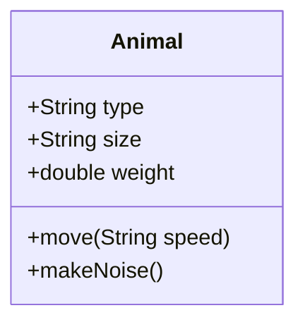

This diagram shows the Animal class with the attributes We think that every kind
of animal has.

Below the fields, I have the behavior that animals have in common: move and
makeNoise.

```java
public class Animal {

    private String type;
    private String size;
    private double weight;

    public Animal(String type, String size, double weight) {
        this.type = type;
        this.size = size;
        this.weight = weight;
    }

    @Override
    public String toString() {
        return "Animal [type=" + type + ", size=" + size + ", weight=" + weight + "]";
    }

    public void move(String speed) {
        System.out.println(type + " moves " + speed);
    }

    public void makeNoise() {
        System.out.println(type + " makes some kind of noise");
    }
}
```

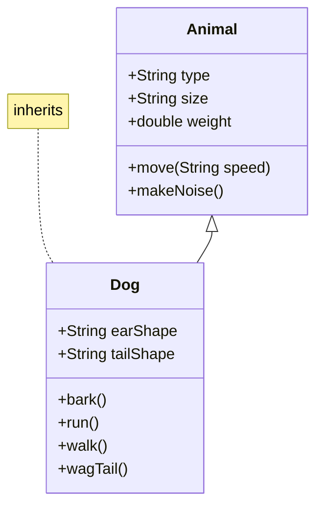

Dog inherits from Animal. In other words, Dog "IS A" type of Animal.

When I create a Dog object, it will inherit Animal's attributes (type, size,
and weight). This is also true for Animal's methods. Dog will inherit these as
well. We can specialize the Dog class with its own fields and behavior.

**Using extends specifies the superclass (or the parent class) of the class
we're declaring**.

We can say Dog is a subclass or child class of Animal. And, we can say Animal is
a parent or super class of Dog.

**A class can specify one and only one class in its extends clause**

```java
public class Dog extends Animal {

}
```

### supper keyword

**super() is a lot like this().** It's a way to call a constructor on the super
class directly from the sub class's constructor.

Like **this()**, it has to be the first statement of constructor. Because of
that rule, **this()** and **super()** can never be called from the same
constructor.

If we don't make a call **super()**, then java makes it for we using super's
default constructor. If super class doesn't have a default constructor, then you
must explicitly call **super()** in all of constructors, passing the right
arguments to that constructor.

Code example:

```java
public class Animal {

    private String type;
    private String size;
    private double weight;

    public Animal() {}

    public Animal(String type, String size, double weight) {
        this.type = type;
        this.size = size;
        this.weight = weight;
    }

    @Override
    public String toString() {
        return "Animal [type=" + type + ", size=" + size + ", weight=" + weight + "]";
    }

    public void move(String speed) {
        System.out.println(type + " moves " + speed);
    }

    public void makeNoise() {
        System.out.println(type + " makes some kind of noise");
    }
}
```

```java
public class Dog extends Animal {

    private String earShape;
    private String tailShape;

    public Dog() {
        super();
    }

    public Dog(String type, double weight, String earShape, String tailShape) {
        super(type, weight < 15 ? "small" : (weight < 35 ? "medium" : "large"), weight);
        this.earShape = earShape;
        this.tailShape = tailShape;
    }

    public Dog(String type, double weight) {
        this(type, weight, "Perky", "Curled");
    }

    @Override
    public String toString() {
        return "Dog [earShape="
                + earShape
                + ", tailShape="
                + tailShape
                + ", toString()="
                + super.toString()
                + "]";
    }
}
```

### Code Re-use

All subclasses can execute methods even though the code is declared on the
parent class. The code doesn't have to be duplicated in each subclass. Example
main class.

```java
public class App {
    public static void main(String[] args) throws Exception {
        Animal animal = new Animal("Generic Animal", "Huge", 400);
        doAnimalStuff(animal, "fast");

        Dog dog = new Dog();
        doAnimalStuff(dog, "fast");
    }

    public static void doAnimalStuff(Animal animal, String speed) {
        animal.makeNoise();
        animal.move(speed);
        System.out.println(animal);
        System.out.println("_______");
    }
}
```

Output:

```text
Generic Animal makes some kind of noise
Generic Animal moves fast
Animal [type=Generic Animal, size=Huge, weight=400.0]
_______
null makes some kind of noise
null moves fast
Dog [earShape=null, tailShape=null, toString()=Animal [type=null, size=null, weight=0.0]]
_______
```

We can use code from the parent. Or we can change that code for the
subclass.

### Overriding a method

Overriding a method is when we create a method on a subclass, which has the
same signature as a method on a super class. We overridden a parent class method
when we want the child class to show different behavior for that method.

```java
public class Dog extends Animal {

    private String earShape;
    private String tailShape;

    public Dog() {
        super();
    }

    public Dog(String type, double weight, String earShape, String tailShape) {
        super(type, weight < 15 ? "small" : (weight < 35 ? "medium" : "large"), weight);
        this.earShape = earShape;
        this.tailShape = tailShape;
    }

    public Dog(String type, double weight) {
        this(type, weight, "Perky", "Curled");
    }

    @Override
    public String toString() {
        return "Dog [earShape="
                + earShape
                + ", tailShape="
                + tailShape
                + ", toString()="
                + super.toString()
                + "]";
    }

    public void makeNoise() {}

    @Override
    public void move(String speed){
        super.move(speed);
        System.out.println("Dogs walk, run and wag their tail");
    }
}
```

```java
public class App {
    public static void main(String[] args) throws Exception {
        Animal animal = new Animal("Generic Animal", "Huge", 400);
        doAnimalStuff(animal, "fast");

        Dog dog = new Dog();
        doAnimalStuff(dog, "fast");
    }

    public static void doAnimalStuff(Animal animal, String speed) {
        animal.makeNoise();
        animal.move(speed);
        System.out.println(animal);
        System.out.println("_______");
    }
}
```

Output:

```text
Generic Animal makes some kind of noise
Generic Animal moves fast
Animal [type=Generic Animal, size=Huge, weight=400.0]
_______
null moves fast
Dogs walk, run and wag their tail
Dog [earShape=null, tailShape=null, toString()=Animal [type=null, size=null, weight=0.0]]
```

The overridden method can do one of three things:

- It can implement completely different behavior, overriding the behavior of the
  parent.
- It can simply call the parent class's method, which is somewhat redundant to
  do.
- Or the method can call the parent class's method and include other code to
  run so it can extend the functionality for the Dog, for that behavior.

## java.lang.Object

Every class we create in Java actually extends a special Java class. That class
named Object, and it's in the java.lang package.

### Every class inherits from Object

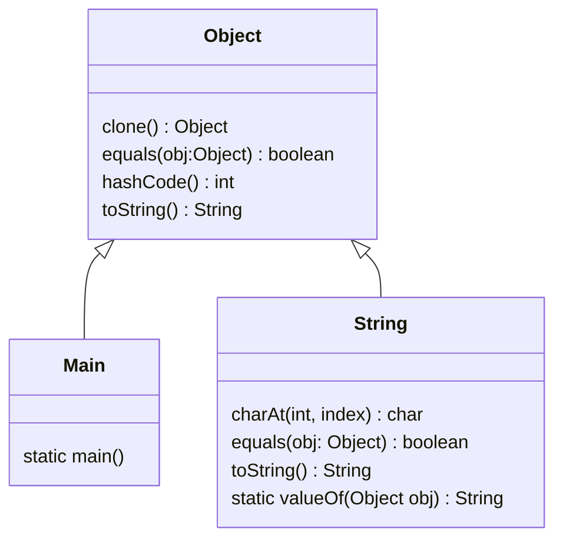

Example:

```java
public class App extends Object {
    public static void main(String[] args) throws Exception {
        System.out.println("Hello, World!");

        Student max = new Student("Max", 21);
        System.out.println(max.toString());
    }
}

class Student {

    private String name;
    private int age;

    Student(String name, int age) {
        this.name = name;
        this.age = age;
    }
}
```

Output:

```text
Student@251a69d7
```

## this vs super

The keyword **super** is used to access or call the parent class members (both
variables and methods).

The keyword **this** is used to call the current class members (both variables and
methods). **this** is required when we have a parameter with the same name as an
instance variable or field.

> [!NOTE]
> We can use either of these two keywords anywhere in a class except for static
> elements such as a static method. Any attempt to do so will lead to compile
> time errors.

### Keyword this

<div style="display: flex; justify-content: space-between;">

<div style="width: 58%;">

```java
public class House {
    private String color;

    public House(String color) {
        this.color = color;
    }

    public String getColor() {
        return color;
    }

    public void setColor(String color) {
        this.color = color;
    }

}
```

</div>

<div style="width: 40%;">

The keyword **this** is commonly used within constructors and setters and is
optionally used within getters.

In this example, We're using the **this** keyword in a **constructor** and **setter** since there's a parameter with the same name as the instance of field.

In the getter, We don't have any parameters so there's no conflict. Therefore, the use of **this** is optional there.

</div>

</div>

### Keyword super

<div style="display: flex; justify-content: space-between;">

<div style="width: 58%;">

```java
class SuperClass { // parent class aka super class
    pulic void printMethod() {
        System.out.println("Printed in SuperClass");
    }
}

class SubClass extends SuperClass {
    // subclass aka child class

    // overrides methods from the parent class
    @Override
    public void printMethod() {
        super.printMethod();
        // calls the method in the SuperClass(parent)
        System.out.println("Printed in SubClass");
    }
}

class MainClass {

    public static void main(String[] args) {
        SubClass s = new SubClass();
        s.printMethod();
    }
}
```

</div>

<div style="width: 40%;">

The keyword **super** is commonly **used** with **method overriding** when we
call a method with the same name from the parent class.

In this example, We have a method called **printMethod** that calls
**super.printMethod**.

</div>

</div>

### this() vs super() call

In Java, we've got the **this()** and **super()** calls. Notice the parentheses.
There are known as calls since they look like regular method calls although
we're calling certain constructors.

> [!NOTE]
> Use **this()** to call a constructor from another overloaded constructor in the
> same class. The call to **this()** can only be used in a constructor, and it
> must be the first statement in a constructor.

It's used with constructor chaining, in other words, when one constructor calls
another constructor, and it helps to reduce duplicated code.

The only way to call a parent constructor is by calling **super()**, which calls
the parent constructors. The java compiler puts a default to call **super()** if
we don't add it, and it's always a call to the no argument constructor, which is
inserted by the compiler.

> [!NOTE]
> The call to **super()** must be the first statement in each constructor.

> [!NOTE]
> A constructor can have a call to **super()** or **this()**, but never both.

### Example bad and good constructor

#### Bad constructor

```java
public class Rectangle1 {
    // Constructors Bad Example

    private int x;
    private int y;
    private int width;
    private int height;

    public Rectangle1() {
        this.x = 0;
        this.y = 0;
        this.width = 0;
        this.height = 0;
    }

    public Rectangle1(int width, int height) {
        this.x = 0;
        this.y = 0;
        this.width = width;
        this.height = height;
    }

    public Rectangle1(int x, int y, int width, int height) {
        this.x = x;
        this.y = y;
        this.width = width;
        this.height = height;
    }
}
```

Here, we have three constructors. All three constructors initialize variables.

There's repeated code in each constructor. We are initializing variables in each
constructor with some default values.

> [!NOTE] >
> **We should never write constructors like this.** Let's look at the right way
> to do this using a **this()** call.

#### Good constructor

```java
public class Rectangle2 {
    // Constructors Good Example

    private int x;
    private int y;
    private int width;
    private int height;

    // 1st constructor
    public Rectangle2() {
        this(0, 0);
    }

    // 2nd constructor
    public Rectangle2(int width, int height) {
        this(0, 0, width, height);
    }

    public Rectangle2(int x, int y, int width, int height) {
        // initialize variables
        this.x = x;
        this.y = y;
        this.width = width;
        this.height = height;
    }
}
```

In this example, We still have three constructors.

The 1st constructor calls the 2nd constructor, the 2nd constructor call the 3rd
constructor initializes the instance variables.

The 3rd constructor does all the work. No matter what constructor I call, the
variables will always be initialized in the 3rd constructor.

> [!NOTE]
> This is known as constructor chaining, the last constructor has the
> responsibility to initialize the variables.

### super() call example.

```java
public class Shape {
    private int x;
    private int y;

    public Shape(int x, int y) {
        this.x = x;
        this.y = y;
    }
}
```

```java
public class Rectangle3 extends Shape {
    private int width;
    private int height;

    // 1st constructor
    private Rectangle3(int x, int y) {
        this(x, y, 0, 0); // calls 2nd constructor
    }

    // 2nd constructor
    public Rectangle3(int x, int y, int width, int height) {
        super(x, y); // calls constructor from parent (shape)
        this.width = width;
        this.height = height;
    }
}
```

In this example, We have a class **Shape**, with x and y instance variables, and
class **Rectangle** that extends **Shape** with variables width and height.

In the Rectangle class, the 1st constructor is calling the 2nd constructor. The
2nd constructor call the parent constructor with parameters x and y.

The parent constructor will initialize the x and y variables, while the 2nd
Rectangle constructor will initialize the width and height variables.

Here, We have both the **super()** and **this()** calls.
