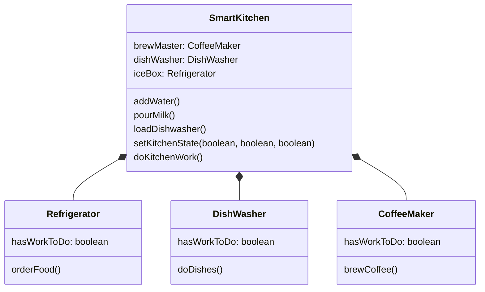

Create an application for controlling a smart kitchen.

Methods on your SmartKitchen class, will determine what work needs to be done:

- addWater() will set the Coffee Maker's hasWorkToDo field to true.
- pourMilk() will set the Refrigerator hasWorkToDo field to true.
- loadDishwasher() will set the hasWorkToDo flag to true for that appliance.
- setKitchenState() that takes three boolean values, which would set each
  appliance accordingly.
