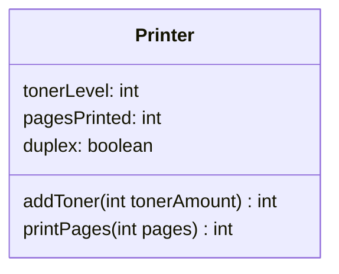

The fields on this class are as follows:

- **tonerLevel**, which is the percentage of toner left in the toner cartridge.
- **pagesPrinted**, which is the count of total pages printed.
- **duplex**, which is an indicator of whether the printer will print on both
  sides of a sheet of pages. True means it can, False means it can only print one
  side of paper.

We'll want to initialize a printer by specifying a starting toner amount and
whether the printer has duplex capabilities, or not.

There methods are:

- addToner() which is takes a tonerAmount argument.
  - tonerAmount is added to the tonerLevel field.
  - The tonerLevel should never exceed 100 percent or ever get below 0 percent.
  - If the amount being added makes the level fall outside that range, return a
  -1 from the method, otherwise return the actual toner level after adding the
  amount passed to the method.
- printPages() which should take pages to be printed as the argument.
  - It should determine how many sheets of paper will be printed. It should take
  into account the duplex value set for the printer. It should return the
  calculated number of sheets of paper.
  - The sheet number should also be added to the pagesPrinted field.
  - If it's a duplex printer, print a message that it's a duplex printer.
