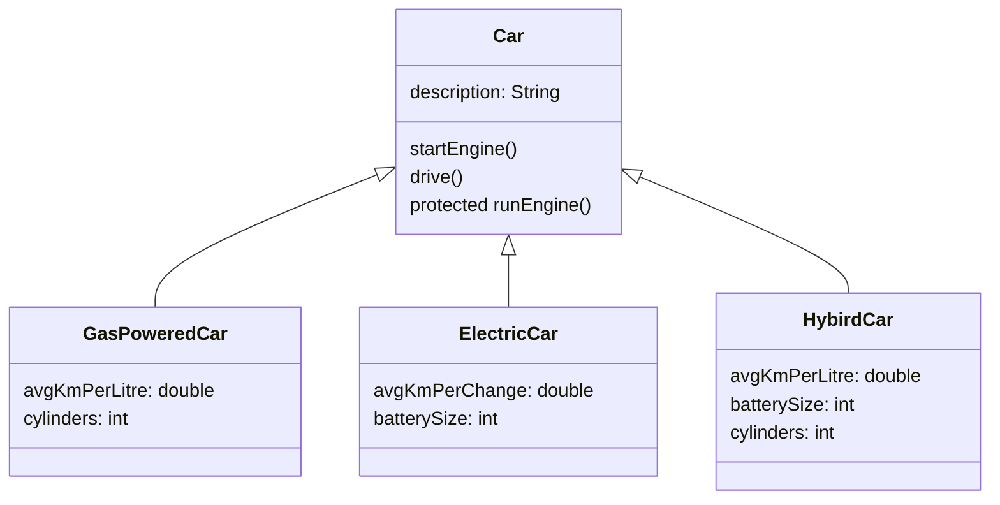

```mermaid
classDiagram
  Car <|-- GasPoweredCar
  Car <|-- ElectricCar
  Car <|-- HybirdCar
  class Car{
    description: String
    startEngine()
    drive()
    protected runEngine()
  }
  class GasPoweredCar{
    avgKmPerLitre: double
    cylinders: int
  }
  class ElectricCar{
    avgKmPerChange: double
    batterySize: int
  }
  class HybirdCar{
    avgKmPerLitre: double
    batterySize: int
    cylinders: int
  }
```
