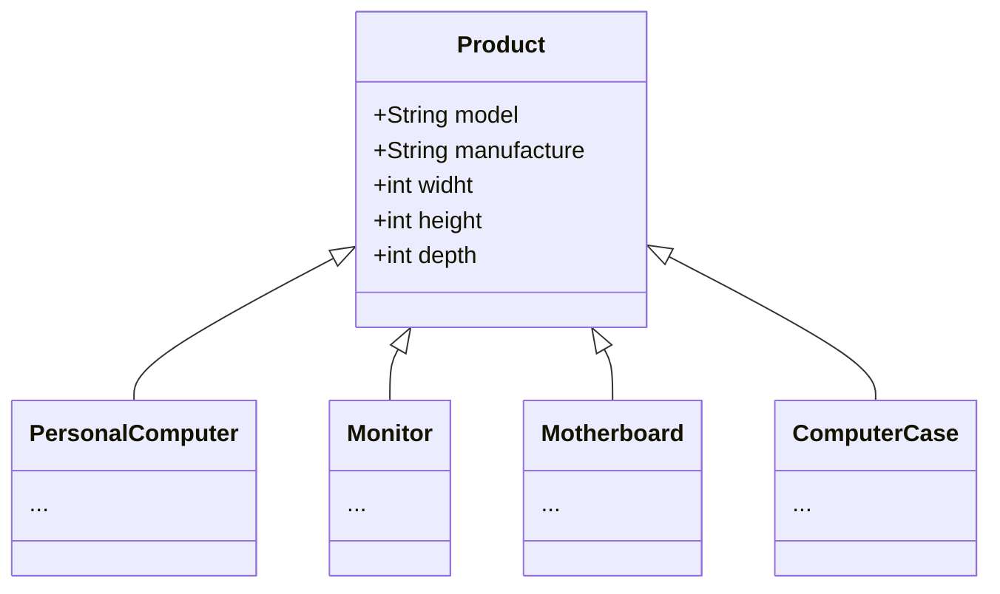
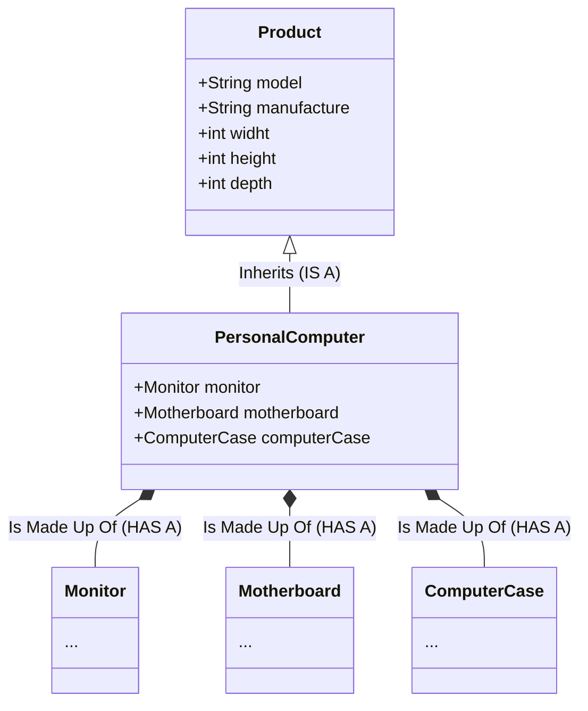
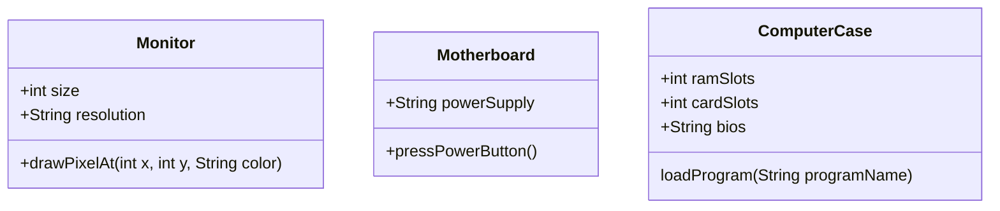
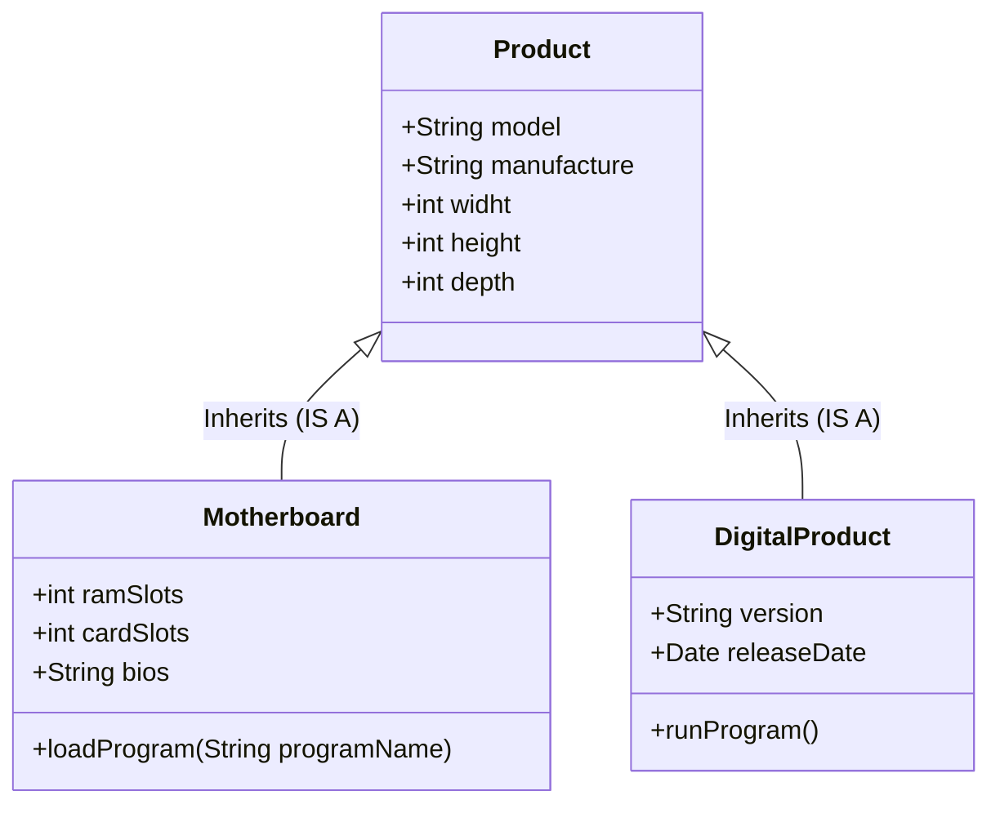
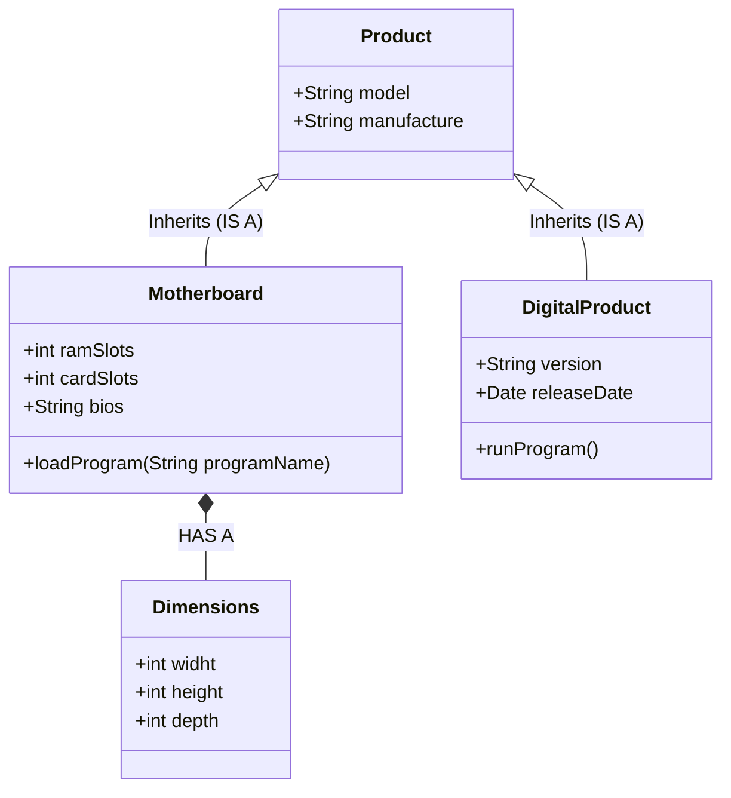
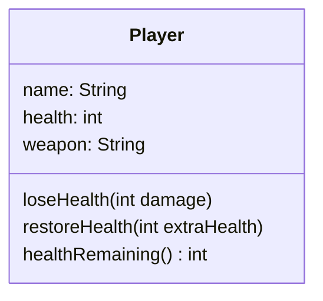
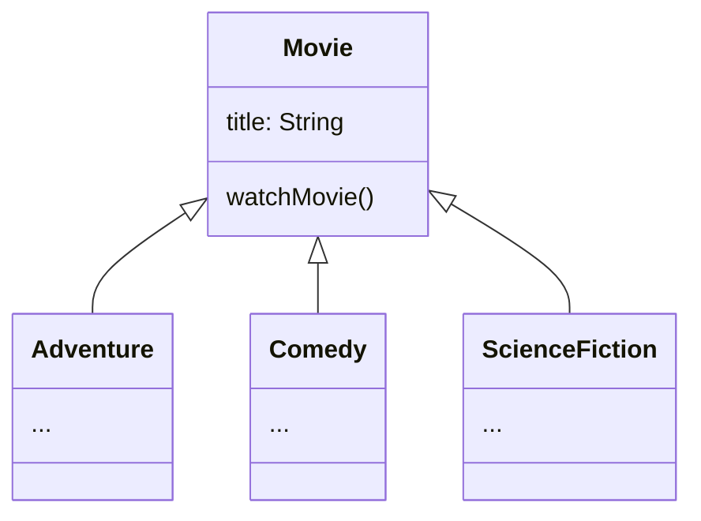

# Document

<!--toc:start-->
- [Document](#document)
  - [Composition](#composition)
    - [Example](#example)
      - [Inheritance Example](#inheritance-example)
      - [Composition Example](#composition-example)
    - [Composition is creating a whole from different parts](#composition-is-creating-a-whole-from-different-parts)
    - [Use Composition or Inheritance or Both ?](#use-composition-or-inheritance-or-both)
    - [Why is Composition preferred over Inheritance in many designs ?](#why-is-composition-preferred-over-inheritance-in-many-designs)
    - [Why is Inheritance less flexible?](#why-is-inheritance-less-flexible)
    - [Example Adding a Digital Product](#example-adding-a-digital-product)
  - [Excapsulation](#excapsulation)
    - [Example](#example)
    - [The problems when classes aren't properly encapsulated](#the-problems-when-classes-arent-properly-encapsulated)
    - [Benefits of Encapsulation](#benefits-of-encapsulation)
    - [Encapsulation Principles](#encapsulation-principles)
  - [Polymorphism](#polymorphism)
    - [Example Movie Genres](#example-movie-genres)
  - [Var type](#var-type)
    - [Local Variable Type Inference (LVTI)](#local-variable-type-inference-lvti)
    - [Run Time vs. Compile Time Typing](#run-time-vs-compile-time-typing)
  - [package](#package)
      - [What is the purpose of package?](#what-is-the-purpose-of-package)
<!--toc:end-->

## Composition

> [!NOTE]
> Inheritance vs Composition
> Inheritance defines an **IS A** relationship.
> Composition defines a **HAS A** relationship.

Inheritance is a way to reuse functionality and attributes.
Composition is a way to make the combination of classes act like a single
coherent object.

### Example

#### Inheritance Example



In this instance, We have a base class called Product. All of my computer parts
are going to inherit from Product.

All my parts will then have the same base set of attributes: manufacture, model,
and dimensions. The width, height, and depth, in other words.

All of these items are products, a particular type of Product.

Code Example:

```java
public class Product {
    private String model;
    private String manufacturer;
    private int width;
    private int height;
    private int depth;

    public Product(String model, String manufacturer) {
        this.model = model;
        this.manufacturer = manufacturer;
    }
}

class Monitor extends Product {
    public Monitor(String model, String manufacturer) {
        super(model, manufacturer);
    }
}

class MotherBoard extends Product {
    public MotherBoard(String model, String manufacturer) {
        super(model, manufacturer);
    }
}

class ComputerCase extends Product {
    public ComputerCase(String model, String manufacturer) {
        super(model, manufacturer);
    }
}
```

#### Composition Example

To keep this diagram simple, PersonalComputer inherits from Product. But a PersonalComputer, in addition to being a product, is actually made up of other parts.



Composition is actually modelling parts, and those parts make up a greater
whole. In this case, We are going to model the personal computer. And we are
modeling the has a relationship with the motherboard, the case, and the monitor.



Code Example:

```java
public class Product {
    private String model;
    private String manufacturer;
    private int width;
    private int height;
    private int depth;

    public Product(String model, String manufacturer) {
        this.model = model;
        this.manufacturer = manufacturer;
    }
}

class Monitor extends Product {
    private int size;
    private String resolution;

    public Monitor(String model, String manufacturer) {
        super(model, manufacturer);
    }

    public Monitor(String model, String manufacturer, int size, String resolution) {
        super(model, manufacturer);
        this.size = size;
        this.resolution = resolution;
    }

    public void drawPixelAt(int x, int y, String color) {
        System.out.println(String.format("Drawing pixel at %d, %d in color %s ", x, y, color));
    }
}

class MotherBoard extends Product {
    private int ramSlots;
    private int cardSlots;
    private String bios;

    public MotherBoard(String model, String manufacturer) {
        super(model, manufacturer);
    }

    public MotherBoard(
            String model, String manufacturer, int ramSlots, int cardSlots, String bios) {
        super(model, manufacturer);
        this.ramSlots = ramSlots;
        this.cardSlots = cardSlots;
        this.bios = bios;
    }

    public void loadProgram(String programName) {
        System.out.println("Program " + programName + " is now loading...");
    }
}

class ComputerCase extends Product {
    private String powerSupply;

    public ComputerCase(String model, String manufacturer) {
        super(model, manufacturer);
    }

    public ComputerCase(String model, String manufacturer, String powerSupply) {
        super(model, manufacturer);
        this.powerSupply = powerSupply;
    }

    public void pressPowerButton() {
        System.out.println("Power button pressed");
    }
}

```

```java
public class PersonalComputer extends Product {
    private ComputerCase computerCase;
    private Monitor monitor;
    private MotherBoard motherBoard;

    public PersonalComputer(
            String model,
            String manufacturer,
            ComputerCase computerCase,
            Monitor monitor,
            MotherBoard motherBoard) {
        super(model, manufacturer);
        this.computerCase = computerCase;
        this.monitor = monitor;
        this.motherBoard = motherBoard;
    }

    public ComputerCase getComputerCase() {
        return computerCase;
    }

    public Monitor getMonitor() {
        return monitor;
    }

    public MotherBoard getMotherBoard() {
        return motherBoard;
    }
}
```

```java
public class App {
    public static void main(String[] args) throws Exception {
        ComputerCase theCase = new ComputerCase("2208", "Dell", "240");
        Monitor theMonitor = new Monitor("27 inch beast", "Acer", 27, "2540x1440");
        MotherBoard theMotherboard = new MotherBoard("BJ-200", "Asus", 4, 6, "v2.44");
        PersonalComputer thePC =
                new PersonalComputer("2208", "Dell", theCase, theMonitor, theMotherboard);

        thePC.getComputerCase().pressPowerButton();
        thePC.getMotherBoard().loadProgram("Windows OS");
        thePC.getMonitor().drawPixelAt(10, 10, "red");
    }
}
```

```text
Power button pressed
Program Windows OS is now loading...
Drawing pixel at 10, 10 in color red
```

### Composition is creating a whole from different parts

We built this personal computer, by passing objects to the constructor, like
assembling the computer.

**We can actually hide the functionality further.** In this case, we are not
going to allow the **calling program** to **access those objects, the parts
directly.** If we don't want anybody to access the Monitor, MotherBoard, or
ComputerCase directly.

```java
public class PersonalComputer extends Product {
    private ComputerCase computerCase;
    private Monitor monitor;
    private MotherBoard motherBoard;

    public PersonalComputer(
            String model,
            String manufacturer,
            ComputerCase computerCase,
            Monitor monitor,
            MotherBoard motherBoard) {
        super(model, manufacturer);
        this.computerCase = computerCase;
        this.monitor = monitor;
        this.motherBoard = motherBoard;
    }

    private void drawLogo() {
        monitor.drawPixelAt(1200, 50, "yellow");
    }

    public void powerUp() {
        computerCase.pressPowerButton();
        motherBoard.loadProgram("Window OS");
        drawLogo();
    }
}
```

```java
public class App {
    public static void main(String[] args) throws Exception {
        ComputerCase theCase = new ComputerCase("2208", "Dell", "240");
        Monitor theMonitor = new Monitor("27 inch beast", "Acer", 27, "2540x1440");
        MotherBoard theMotherboard = new MotherBoard("BJ-200", "Asus", 4, 6, "v2.44");
        PersonalComputer thePC =
                new PersonalComputer("2208", "Dell", theCase, theMonitor, theMotherboard);
        thePC.powerUp();
    }
}
```

```text
Power button pressed
Program Window OS is now loading...
Drawing pixel at 1200, 50 in color yellow
```

### Use Composition or Inheritance or Both ?

As a general rule, when we are designing your programs in Java, you probably
want to look at composition first.

> [!NOTE]
> Most of the experts will tell we that as a rule, look at using composition
> before implementing inheritance.

In example, We actually used both.

### Why is Composition preferred over Inheritance in many designs ?

The reasons composition is preferred over inheritance:

- Composition is more flexible. We can add parts in or remove them, and these
  changes are less likely to have a downstream effect.
- Composition provides functional reuse outside of the class hierarchy, meaning
  classes can share attributes & behavior, by having similar components, instead
  of inheriting functionality from a parent or base class.
- Java's inheritance breaks encapsulation because subclasses may need direct
  access to a parent's state or behavior.

### Why is Inheritance less flexible?

> [!NOTE]
> Inheritance is less flexible.

Adding a class to or removing a class from a class hierarchy may impact all
subclasses from that point.

In addition, a new subclass may not need all the functionality or attributes of
its parent class.

### Example Adding a Digital Product

We want to include digital products, such as software products in my product
inventory. Should DigitalProduct inherit from Product?

Here, we show the model with DigitalProduct, inheriting from my current
definition of Product.



If we do this, this would mean DigitalProduct has Product attributes, but this
isn't true now.

A digital product wouldn't really have width, height, and depth, so this model
isn't a good representation of what we want to build.

It would be better if we didn't have those three attributes on Product, but
instead used composition to include them on certain products, but not all
products.

Example:



## Excapsulation

In Java, encapsulation means hiding things by making them private or
inaccessible.

**Why hide things?** Because:

- To make the interface simpler, we may want to hide unnecessary details.
- To protect the integrity of data on an object, we may hide or restrict access
  to some of the data and operations.
- To decouple the published interface from the internal details of the class, we
  may hide actual names and types of class members. (Although Java has a type
  called interface, that's not what we are talking about here. When we talk about
  a class's public or published interface, we are really talking about the class
  members that are exposed to or can be accessed by the calling code).

### Example



This is model for a Player class. The Player has three fields: name, health, and
weapon. This class has three method: loseHealth(), restoreHealth(), and
healthRemaining().

Example code without using encapsulation:

```java
public class Player {

    public String name;
    public int health;
    public String weapon;

    public void loseHealth(int damage) {
        health = health - damage;
        if (health <= 0) {
            System.out.println("Player knocked out of game");
        }
    }

    public int healthRemaining() {
        return health;
    }

    public void restoreHealth(int extraHealth) {
        health = health + extraHealth;

        if (health > 100) {
            System.out.println("Player restored to 100%");
            health = 100;
        }
    }
}
```

```java
public class App {
    public static void main(String[] args) throws Exception {
        Player player = new Player();
        player.name = "Tim";
        player.health = 20;
        player.weapon = "Sword";

        int damage = 10;
        player.loseHealth(damage);
        System.out.println("Remaining health = " + player.healthRemaining());
        player.health = 200;
        player.loseHealth(11);
        System.out.println("Remaining health = " + player.healthRemaining());
    }
}
```

> [!WARNING] > **Problem One:**
> Allowing direct access to data on an object can potentially bypass checks and
> additional processing your class has in place to manager the data.

In player class:

```java
// attributes (fields) is public
public String name;
public int health;
public String weapon;
```

attributes (fields) can access in any where. Example in main class:

```java
Player player = new Player();
player.name = "Tim";
player.health = 20;
player.weapon = "Sword";
```

> [!WARNING]
> Problem Two:
> Allowing direct access to fields means calling code would need to change when
> we edit any of the fields.

> [!WARNING]
> Problem Three:
> Omitting a constructor that would accepts initialization data means the
> calling code is responsible for setting up this data on the new object.

### The problems when classes aren't properly encapsulated

Allowing direct access to data on an object can bypass checks and operations. It
encourages an interdependency or coupling between the calling code and the
class. For example: changing a field name broke the calling code.

Example code:

```java
public class EnhancedPlayer {

    private String name;
    private int health;
    private String weapon;

    public EnhancedPlayer(String name) {
        this(name, 100, "Sword");
    }

    public EnhancedPlayer(String name, int health, String weapon) {
        this.name = name;
        if (health <= 0) {
            this.health = 1;
        } else if (health > 100) {
            health = 100;
        } else {
            this.health = health;
        }
        this.weapon = weapon;
    }

    public void loseHealth(int damage) {
        health = health - damage;
        if (health <= 0) {
            System.out.println("Player knocked out of game");
        }
    }

    public int healthRemaining() {
        return health;
    }

    public void restoreHealth(int extraHealth) {
        health = health + extraHealth;

        if (health > 100) {
            System.out.println("Player restored to 100%");
            health = 100;
        }
    }
}
```

```java
public class App {
    public static void main(String[] args) throws Exception {
        // Player player = new Player();
        // player.name = "Tim";
        // player.health = 20;
        // player.weapon = "Sword";

        // int damage = 10;
        // player.loseHealth(damage);
        // System.out.println("Remaining health = " + player.healthRemaining());
        // player.health = 200;
        // player.loseHealth(11);
        // System.out.println("Remaining health = " + player.healthRemaining());

        // EnhancedPlayer tim = new EnhancedPlayer("Tim");
        // or
        EnhancedPlayer tim = new EnhancedPlayer("Tim", 100, "Sword");
        System.out.println("Inital health is " + tim.healthRemaining());
    }
}
```

### Benefits of Encapsulation

> [!NOTE]
> Changes made do not affect any other code. It like a black box in many ways.
> But the enhanced player class has full control over its data.

**This is why we want to use encapsulation.**We protect the members of the
class and some methods from external access. This prevents calling code from
bypassing the rules and constraints we've built into the class.

When we create a new instance, it's initialized with valid data. But likewise,
we are also making sure that there's no direct access to the fields. That why we
want to always use encapsulation.

### Encapsulation Principles

To create an encapsulated class, we want to:

- Create constructors for object initialization, which enforces that only object
  valid data will get created.
- Use the private access modifier for your fields.
- Use setter methods sparingly and only as needed.
- Use access modifier that aren't private, only for the methods that calling
  code needs to use.

## Polymorphism

> [!NOTE]
> Simple, Polymorphism means many forms.

Polymorphism in Java allows us to write code that can call a method, but the
actual method that gets executed can be different for different objects at
runtime. This means that the behavior that occurs during program execution
depends on the runtime type of the object, which might differ from its declared
type in the code.

For polymorphism to work, the declared type must have a relationship with the
runtime type. **Inheritance is one way to establish this relationship, where a
subclass can override a method from its superclass, enabling polymorphism
behavior.**

### Example Movie Genres



We are going to look at a polymorphism example using movies. We'll have a base
class of Movies, which has the title of the movie.

We will have 3 subclass, each a different kind of movie (Adventure, Comedy,
Science Fiction). The are the different categories, so we will use these as the
subclasses. All of these will override and implement unique behavior for the
watchMovie method.

```java
public class Movie {

    private String title;

    public Movie(String title) {
        this.title = title;
    }

    public void watchMovie() {
        String instanceType = this.getClass().getSimpleName();
        // returns class type information about the runtime instance.
        System.out.println(title + " is a " + instanceType + " film");
    }
}
```

```java
public class App {
    public static void main(String[] args) throws Exception {

        Movie theMovie = new Movie("Star Wars");
        theMovie.watchMovie();
    }
}
```

Output

```text
Star Wars is a Movie film
```

Add inheritance for Adventure class:

```java
class Adventure extends Movie {
    public Adventure(String title) {
        super(title);
    }

    @Override
    public void watchMovie() {
        super.watchMovie();
        System.out.printf(
                ".. %s%n".repeat(3), "Pleasant Scene", "Scary Music", "Something Bad Happens");
    }
}
```

Main class

```java
public class App {
    public static void main(String[] args) throws Exception {

        Movie theMovie = new Adventure("Star Wars");
        theMovie.watchMovie();

    }
}
```

Output

```text
Star Wars is a Adventure film
.. Pleasant Scene
.. Scary Music
.. Something Bad Happens
```

Full Example:

```java
public class Movie {

    private String title;

    public Movie(String title) {
        this.title = title;
    }

    public void watchMovie() {
        String instanceType = this.getClass().getSimpleName();
        // returns class type information about the runtime instance.
        System.out.println(title + " is a " + instanceType + " film");
    }

    public static Movie getMovie(String type, String title) {
        return switch (type.toUpperCase().charAt(0)) {
            case 'A' -> new Adventure(title);
            case 'C' -> new Comedy(title);
            case 'S' -> new ScienceFiction(title);
            default -> new Movie(title);
        };
    }
}

class Adventure extends Movie {
    public Adventure(String title) {
        super(title);
    }

    @Override
    public void watchMovie() {
        super.watchMovie();
        System.out.printf(
                ".. %s%n".repeat(3),
      "Pleasant Scene", "Scary Music", "Something Bad Happens");
    }
}

class Comedy extends Movie {
    public Comedy(String title) {
        super(title);
    }

    @Override
    public void watchMovie() {
        super.watchMovie();
        System.out.printf(
                ".. %s%n".repeat(3),
                "Something funny happens",
                "Sometime even funnier happens",
                "Happy Ending");
    }
}

class ScienceFiction extends Movie {
    public ScienceFiction(String title) {
        super(title);
    }

    @Override
    public void watchMovie() {
        super.watchMovie();
        System.out.printf(
                ".. %s%n".repeat(3),
                "Bad Aliens do Bad Stuff",
                "Space Guys Chase Aliens",
                "Planet Blows Up");
    }
}
```

Main class

```java
public class App {
    public static void main(String[] args) throws Exception {
        Movie theMovie = Movie.getMovie("Adventure", "Star Wars");
        theMovie.watchMovie();
    }
}
```

**That was polymorphism in action.**

It's the ability to execute different behavior, for different types, which are
determined at runtime. And yet, we did it with just two statements in the main
method, as show here:

```java
Movie theMovie = Movie.getMovie("Adventure", "Star Wars");
theMovie.watchMovie();
```

**Polymorphism enables we to write generic code based on the base class of a
parent class.** And this code in the main method is extendable, meaning, it
doesn't have to change as new subclasses become available.

This code can handle any instances that are a movie or a subclass of movie that
are returned from the factory method.

## Var type

var is a special contextual keyword in Java that lets our code take advantage of
Local Variable Type Inference. By using var as the type, we're telling java to
figure out the compile-time type for us.

### Local Variable Type Inference (LVTI)

Local Variable Type Inference was introduced in Java 10.

One of the benefits is help with readability of code. Another is to reduce
boilerplate code.

It's called Local Variable Type Inference for a reason, because:
- It can't be used in field declarations on a class.
- It can't be used in method signatures, either as a parameter type of a return
type.
- It can be used without an assignment because the type can't be inferred in
that case.
- It can't be assigned a null literal, again, because a type can't be inferred
in that case.

### Run Time vs. Compile Time Typing

We can thinks of the compile time type as the **declared** type. This type is
declared as a variable reference, a method return type, or a method parameter,
for example.

In the case of Local Variable Type Inference (LVTI), we don't explicitly declared
a type for the compiler reference type. Instead, it gets inferred by the
compiler, but the byte code generated is the same as if we had declared the
type.

In many cases, the compiler time type is the declared type to the left of the
assignment operator. What is returned on the right side of the assignment
operator from whatever expression or method is executed, sometimes can only be
determined at runtime, when the code is executing conditionally through the
statements in the code.

We can assign a runtime instance to a different compile time type, only if
certain rules are followed. And, We can assign an instance to a variable of the
same type, or a parent type, or a parent's parent type, including
java.lang.Object, the ultimate base class.

**Why are runtime types different than compile time types?**

Because of polymorphism. Polymorphism lets us write code once, in a more generic
fashion, like example above. We saw that those two lines of code, using a single
compile time type of Movie, actually supported four different runtime types.
Each type was able to execute behavior unique to the class.

## package

As per the Oracle Java Documentation:

> a package is a namespace that organizes a set of related type

In general, a package corresponds to a folder or directory on the operating
system, but this isn't a requirement.

The package structure is hierarchical, meaning we group types in a tree-like
fashion. We can use any legal java identifier for we package names, but common
practice has package names in all lowercase.

#### What is the purpose of package?

Packages let us reuse common class names across different libraries or
application and provide a way to identify the correct class either with an
import statement or a qualifying name.

For example, we might have a package for utility classes that can provide common
functionality for all of we classes to access.

Packages let us organize our classes by functionality or relationships. Packages
also let us encapsulate our classes from classes in other packages.

We might have a package of tightly coupled classes that should only be accessed
by each other but not by the outside world.
